# 🌍 Travel.Web - MongoDB Seyahat Rezervasyon Platformu

Travelio, enterprise-grade bir seyahat rezervasyon ve yönetim platformudur. **MongoDB NoSQL veritabanı**, **ASP.NET Core 8.0 Razor Pages**, **AutoMapper**, **FluentValidation** ve **ASP.NET Core Identity** kullanılarak geliştirilmiştir. Proje, kombi yönetici paneli (Admin Area) ve müşteri portalı (User Area) ile tam bir turizmcilik çözümü sunmaktadır.

**Mimari Özellikleri:**
- Multi-tenant Areas yapısı (Admin / User)
- Service Layer pattern ile veri işleme
- DTO-Entity mapping ile veri transfer
- FluentValidation ile type-safe doğrulama
- MongoDB ile NoSQL veri depolama
- Çok dil desteği (Türkçe/İngilizce)
- Excel ve PDF rapor oluşturma

---

## 🎯 Proje Özellikleri ve Detaylı İşlevler

### 🏢 Yönetici Paneli
- **Dashboard**: Genel istatistikler, popüler turlar ve son rezervasyonlar
- **Tur Yönetimi**: Yeni tur oluşturma, güncelleme ve silme
- **Kategori Yönetimi**: Tur kategorilerinin düzenlenmesi
- **Destinasyon Yönetimi**: Seyahat destinasyonlarının yönetilmesi
- **Rezervasyon Takibi**: Tüm müşteri rezervasyonlarının görüntülenmesi ve yönetilmesi
- **Yorum Moderasyonu**: Müşteri yorumlarının onaylanması veya reddedilmesi
- **Soru Yönetimi**: İletişim formları ve müşteri sorularının yanıtlanması
- **Kullanıcı Yönetimi**: Müşteri hesaplarının yönetilmesi
- **İstatistiksel Raporlar**: Tur katılımcı raporları ve Excel dışa aktarımı

### 👥 Müşteri Portalı
- **Kullanıcı Hesabı**: Kayıt, giriş ve profil yönetimi
- **Tur Listesi**: Filtreleme, arama ve sayfalama ile turları görüntüleme
- **Tur Detayları**: Fotoğraf galerisi, program detayları ve fiyat bilgisi
- **Favori Turlar**: Beğenilen turları favorilere ekleme
- **Rezervasyon**: Turlar için tarih seçerek rezervasyon yapma
- **Yorum ve Puanlama**: Tamamlanan turlar için yorum bırakma
- **Profil Yönetimi**: Kişisel bilgileri güncelleme ve rezervasyon geçmişi
- **İletişim Formu**: Şirkete sorular ve talep gönderme
- **Çok Dil Desteği**: Türkçe ve İngilizce arayüz

---

## 🛠️ Teknoloji Stack

| Alan | Teknoloji |
|------|-----------|
| **Framework** | ASP.NET Core 8.0 |
| **Sunum** | Razor Pages / ASP.NET MVC |
| **Veritabanı** | MongoDB 3.10.0 |
| **ORM** | MongoDB Driver |
| **Identity** | AspNetCore.Identity.MongoDbCore 7.0.0 |
| **Mapper** | AutoMapper 12.0.1 |
| **Validasyon** | FluentValidation 11.3.1 |
| **PDF Oluşturma** | QuestPDF 2026.8.0 |
| **Excel Export** | ClosedXML 0.105.1 |
| **Sayfalama** | X.PagedList 10.5.9 |
| **Çok Dil** | Microsoft.Extensions.Localization |
| **Frontend** | Bootstrap 5, jQuery, JavaScript |

---

## 📁 Proje Yapısı

```
Travel.Web/
├── Areas/
│   ├── Admin/                    # Yönetici paneli
│   │   ├── Controllers/          # Model bağlantısı ve iş mantığı
│   │   ├── Views/                # Admin UI şablonları
│   │   └── ViewComponents/       # Yeniden kullanılabilir UI bileşenleri
│   └── User/                     # Müşteri portalı
│       ├── Controllers/          # Müşteri işlemlerini yönetme
│       ├── Views/                # Müşteri UI şablonları
│       ├── ViewComponents/       # Müşteri UI bileşenleri
│       └── Models/               # Sayfa model sınıfları
├── DTOs/                         # Veri Transfer Nesneleri (DTO)
│   ├── AccountDtos/              # Kullanıcı işlemleri DTOs
│   ├── TourDtos/                 # Tur DTOs
│   ├── ReservationDtos/          # Rezervasyon DTOs
│   ├── CommentDtos/              # Yorum DTOs
│   └── ...                       # Diğer DTOs
├── Entities/                     # Veritabanı varlık sınıfları
│   ├── Common/                   # Base sınıflar
│   ├── Enums/                    # Numaralandırmalar
│   ├── Tour.cs                   # Tur modeli
│   ├── Reservation.cs            # Rezervasyon modeli
│   └── ...                       # Diğer varlıklar
├── Services/                     # Veri işleme katmanı
│   ├── TourServices/             # Tur hizmetleri
│   ├── ReservationServices/      # Rezervasyon hizmetleri
│   ├── CommentServices/          # Yorum hizmetleri
│   └── ...                       # Diğer hizmetler
├── Mappings/                     # AutoMapper profilleri
├── Validations/                  # FluentValidation kuralları
├── Resources/                    # Çok dil kaynakları (.resx)
├── Settings/                     # MongoDB ayarları
├── wwwroot/                      # Statik dosyalar
│   ├── css/                      # CSS stil dosyaları
│   ├── js/                       # JavaScript dosyaları
│   ├── lib/                      # Bootstrap, jQuery vb.
│   ├── theme/                    # HTML template demo dosyaları
│   └── uploads/                  # Yüklenen resimler (tur, destinasyon)
├── Views/                        # Ana sayfalar
├── Program.cs                    # Uygulama başlatma ve DI kurulumu
├── appsettings.json              # MongoDB bağlantı ayarları
└── launchSettings.json           # Geliştime ortamı ayarları
```

---

## 🚀 Kurulum ve Çalıştırma

### Adımlar

1. **Projeyi Klonla**
   ```bash
   git clone https://github.com/ComputerUni/MongoDbTravel.git
   cd MongoDbTravel
   ```

2. **Bağımlılıkları Yükle**
   ```bash
   dotnet restore
   ```

3. **appsettings.json Ayarla**
   ```json
   {
	 "DatabaseSettings": {
	   "ConnectionString": "mongodb://localhost:27017",
	   "DatabaseName": "TravelDb"
	 }
   }
   ```

4. **Projeyi Çalıştır**
   ```bash
   dotnet run
   ```

5. **Tarayıcıda Aç**
   - Web Sitesi: `https://localhost:7000`
   - Yönetici Paneli: `https://localhost:7000/Admin` (admin hesabı gerekli)

---

## 📸 Ekran Görüntüleri

### Yönetici Paneli

#### Anasayfa
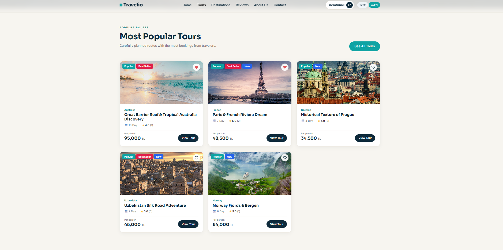

#### Turlar ve Destinasyonlar

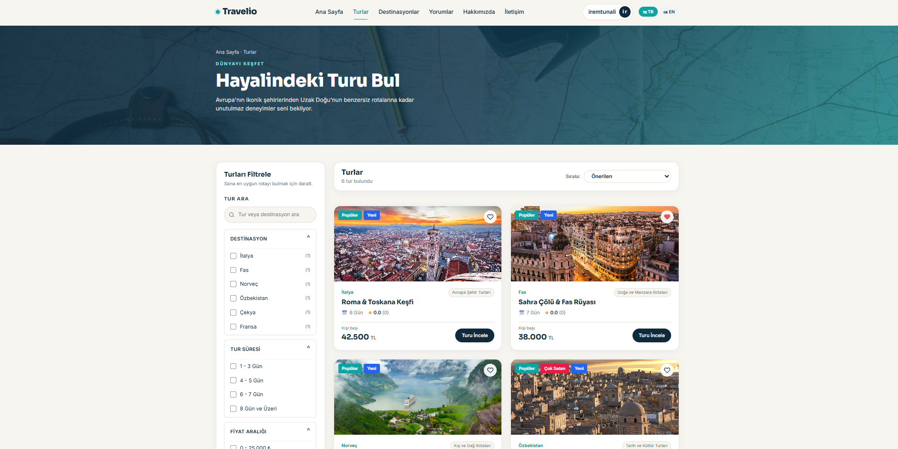
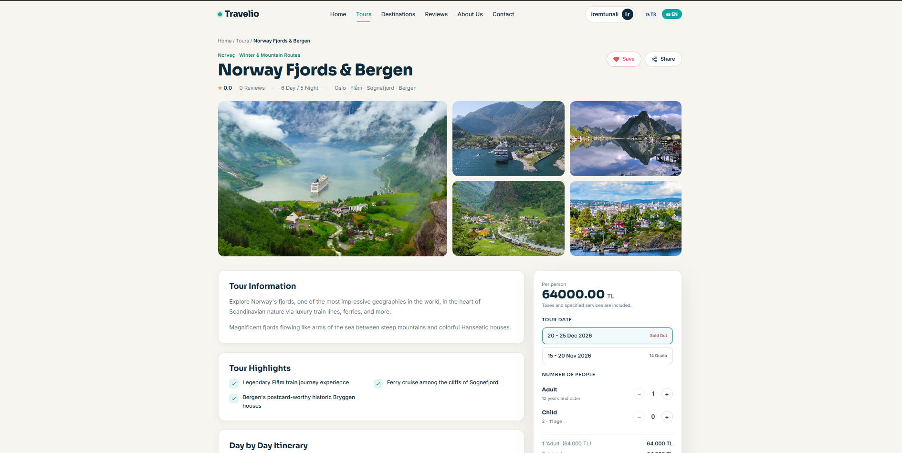

#### Profil Yönetimi
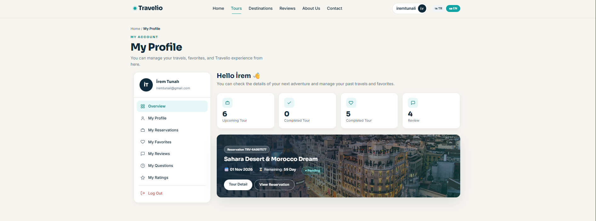

#### Rezervasyon Takibi
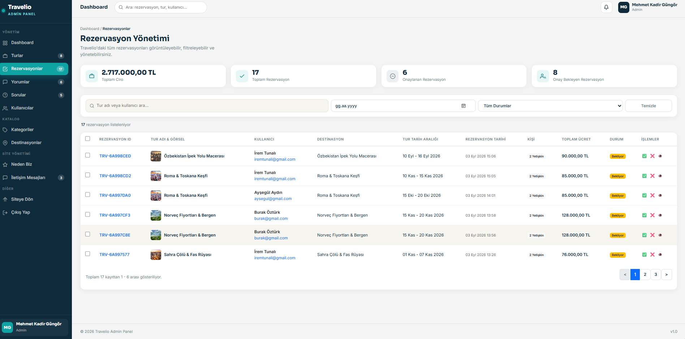

#### Kullanıcı ve Yorum Yönetimi
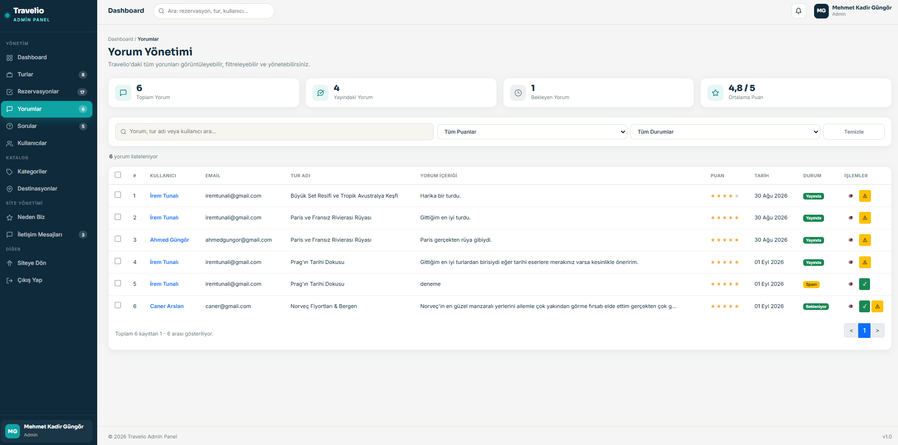
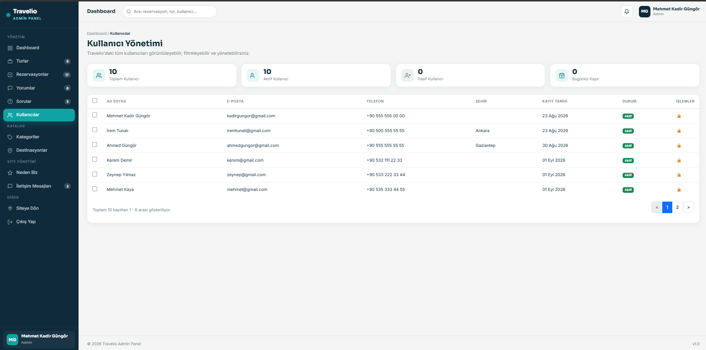

#### Destinasyon Yönetimi
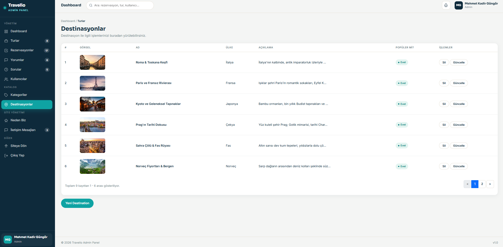

---

### Müşteri Portalı

#### Neden Biz
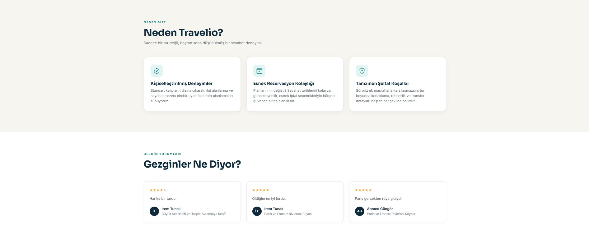

#### Tur Yorum ve Soru
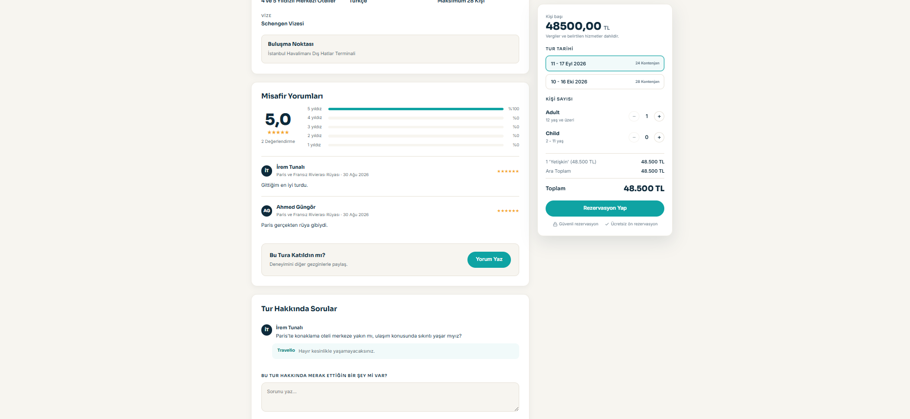
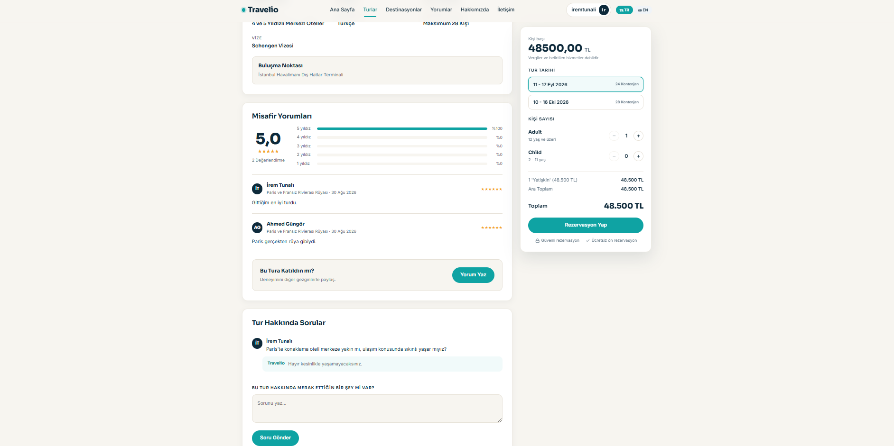

#### Profil

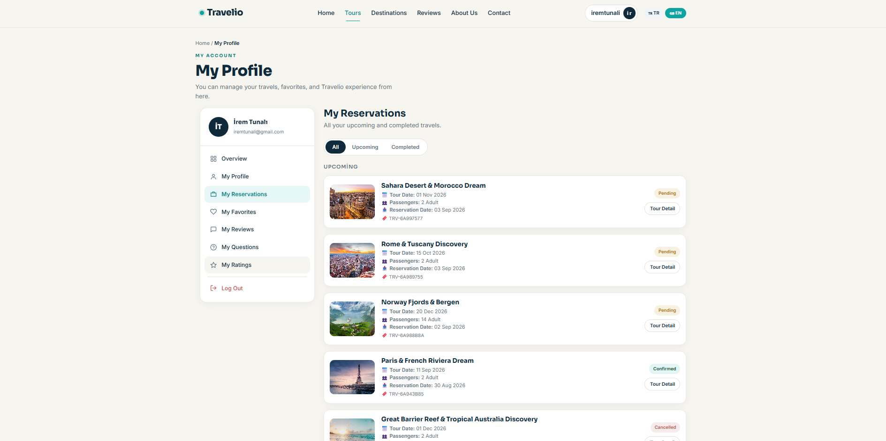

#### Favoriler ve Yorumlar
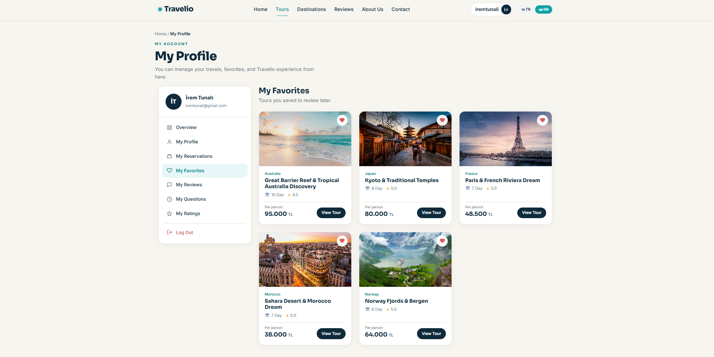
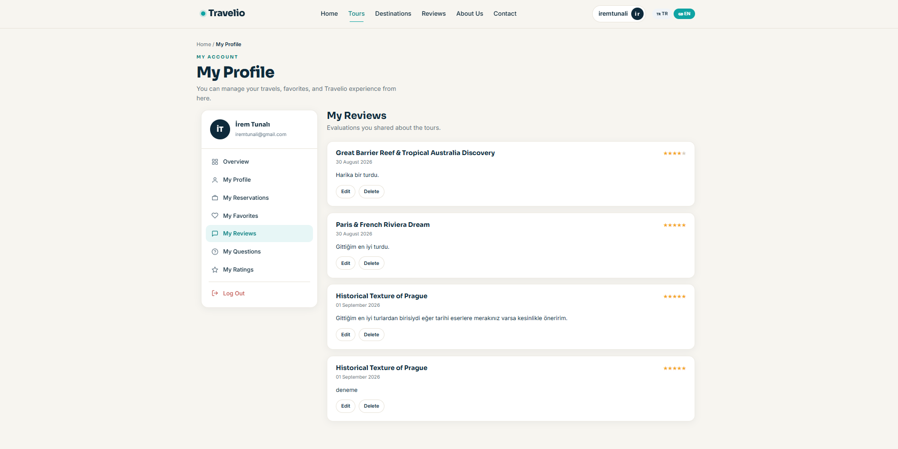

#### Sorular
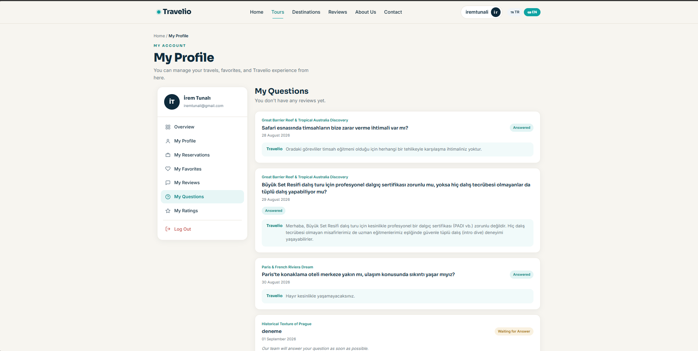

#### Rezervasyon Modal
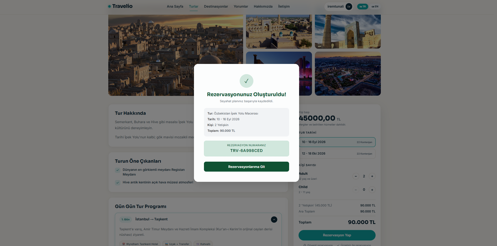

---

## 🔐 Güvenlik

- **Authentication**: ASP.NET Core Identity + MongoDB
- **Authorization**: Role Based Access Control (Admin/User)
- **Veri Doğrulama**: FluentValidation ile client ve server tarafında doğrulama

---

## 📊 Kullanılan Desenler ve Best Practices

### Mimari Düzen
- **MVC Pattern**: ASP.NET Core Areas ile yönetici ve kullanıcı alanlarının ayrılması
- **Service Layer**: Veri işleme için service sınıfları
- **Repository Pattern**: MongoDB veri erişim katmanı
- **Dependency Injection**: Program.cs içinde tüm servislerin kaydı

### Kod Kalitesi
- **FluentValidation**: Tür güvenli veri doğrulama
- **AutoMapper**: DTO ve Entity dönüşümleri için
- **ViewComponents**: Yeniden kullanılabilir UI bileşenleri
- **Localization**: Çok dil desteği kaynakları

---

## 🎯 API Endpoint Örnekleri

### Admin Endpoints
- `GET/POST /Admin/Tour` - Tur listesi ve oluşturma
- `GET/POST /Admin/Reservation` - Rezervasyon yönetimi
- `GET/POST /Admin/Comment` - Yorum yönetimi
- `GET/POST /Admin/Dashboard` - Panel istatistikleri

### User Endpoints
- `GET /User/Home` - Anasayfa
- `GET /User/Tour` - Tur listesi
- `GET /User/Tour/Detail/{id}` - Tur detayları
- `POST /User/Reservation` - Rezervasyon oluşturma
- `POST /User/Comment` - Yorum ekleme

---

## 📝 Veritabanı Şeması

### Ana Koleksiyonlar

#### Users (Kullanıcılar)
```
{
  _id: ObjectId,
  Email: string,
  FirstName: string,
  LastName: string,
  PhoneNumber: string,
  PasswordHash: string,
  IsActive: boolean,
  CreatedDate: DateTime,
  LastLoginDate: DateTime?
}
```

#### Tours (Turlar)
```
{
  _id: ObjectId,
  Title: string,
  Description: string,
  ImageUrl: string,
  Price: decimal,
  Duration: int,
  Capacity: int,
  Destination: ObjectId,
  Category: ObjectId,
  Rating: double,
  DayPrograms: [DayProgram],
  TourDates: [TourDate],
  IsActive: boolean,
  CreatedDate: DateTime,
  UpdatedDate: DateTime?
}
```

#### Reservations (Rezervasyonlar)
```
{
  _id: ObjectId,
  UserId: ObjectId,
  TourId: ObjectId,
  ReservationDate: DateTime,
  TourDate: DateTime,
  PersonCount: int,
  TotalPrice: decimal,
  Status: ReservationStatus,
  SpecialRequests: string,
  CreatedDate: DateTime,
  UpdatedDate: DateTime?
}
```

#### Comments (Yorumlar)
```
{
  _id: ObjectId,
  UserId: ObjectId,
  TourId: ObjectId,
  Rating: int,
  Text: string,
  Status: CommentStatus,
  CreatedDate: DateTime
}
```

---